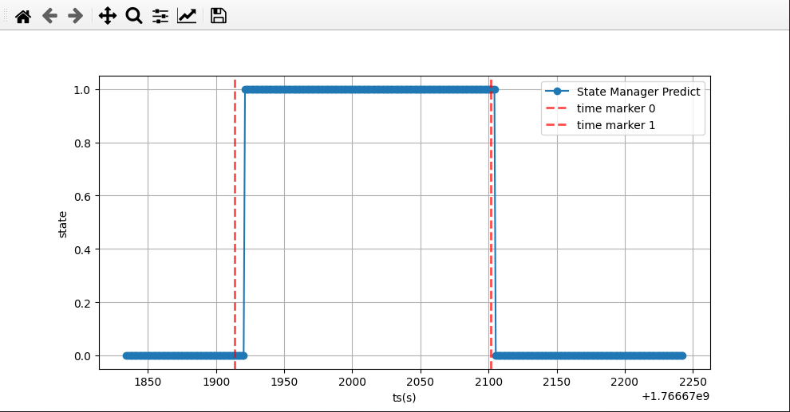

# StateManager

## 1. 数据准备
### 训练数据集
车载和行人数据分别用i2NavLogger采集后，保存在下面的文件夹中：<br>
```path
./Data/Car
./Data/Pedestrian
```
### 测试数据
测试数据包含车载和手持两种状态的数据，每次切换状态时，需要打点(timemarker)区分状态<br>
使用i2NavLogger采集后，保存在下面的文件夹中：<br>
```path
./Data/TestData
```

## 2. 训练决策树
使用`TrainDecisionTree.py`训练并保存决策树模型<br>
需要传入训练数据集路径和超参数<br>
```demo
root_path = os.path.join(os.getcwd(), "Data") # 训练数据集
test_path = "./Data/TestData/2025_12_25_22_10_26_196" # 测试数据
# 超参数
hyperparameter = {
    'freq':100.0, # imu频率
    'fft_len':512 # 傅里叶变换点数
}
```

训练完成后，决策树模型会保存为：<br>
```path
./decision_tree.cpp # 用于后续在c++中测试
./decision_tree_model.pkl
```

## 3. 测试
### 3.1 部署决策树
将训练结果`./decision_tree.cpp`中的代码，拷贝到`./TestInCppProject/src/StateManager.cpp`中
```code
    void StateManager::decision_tree(double* input, double* output){
    }
``` 
因为c++版本问题，直接拷贝过去可能会编译报错，以下是报错代码
```code
    memcpy(var0, (double[]){1.0, 0.0}, 2 * sizeof(double));
```
修改为
```code
    const double arr0[2] = {0.0, 1.0};
    const double arr1[2] = {1.0, 0.0};
    memcpy(var0, arr0, 2 * sizeof(double)); // 使用已定义的数组
```

### 3.2 输入 与 输出
在TestInCppProject中，保存了用于测试的第三方库，和状态管理的最小实现<br>
在`./TestInCppProject/src/main.cpp`中，调用StateManager进行状态识别<br>
需要输入已经同步时间的IMU和AHRS数据<br>
```input
string input_file_path = "./Data/TestData/2025_12_25_22_10_26_196/time-acc-gyr-mag-qwxyz.txt";
// 同步数据的python脚本为GenerateSyncData.py
// 在训练决策树的时候，已经完成了同步
```

运行结束后，会输出状态识别结果到`./TestInCppProject/status_log.txt`<br>
```output
./TestInCppProject/status_log.txt
```

### 3.3 注意事项
在StateManager中，有以下参数可以设置，参数说明<br>
注意： fft_len 与 sample_freq 必须与训练决策树时的参数一致<br>
```code
    fft_len = 512; // 傅里叶变换点数
    sample_freq = 100.0; // 信号采样频率
    
    update_time = 1.0; // 每间隔1s，判断一次状态
    atomic_phone_state_ = PhoneState::Unknown; // 初始状态设置为未知
    delay_transfer = true; // 是否开启延迟切换，防止状态频繁切换
    delay_time = 4.0; // 延迟4s切换，延迟时间越长越稳定
```

决策树的输入特征顺序必须与训练时一致<br>
feature in cpp:
```code
    feature_input.push_back(acc_mean);
    feature_input.push_back(acc_std);
    feature_input.push_back(gyr_mean);
    feature_input.push_back(gyr_std);
    feature_input.push_back(acc_ratio_5Hz);
    feature_input.push_back(acc_ratio_10Hz);
    feature_input.push_back(acc_ratio_20Hz);
    feature_input.push_back(acc_ratio_30Hz);
    feature_input.push_back(gyr_ratio_5Hz);
    feature_input.push_back(gyr_ratio_10Hz);
    feature_input.push_back(gyr_ratio_20Hz);
    feature_input.push_back(gyr_ratio_30Hz);
```

feature in python:
```code
    features = {
        'acc_mean': np.mean(acc_norm),
        'acc_std': np.std(acc_norm),
        'gyro_mean': np.mean(gyro_norm),
        'gyro_std': np.std(gyro_norm),
        'acc_ratio_5Hz': acc_ratio_5Hz,
        'acc_ratio_10Hz': acc_ratio_10Hz,
        'acc_ratio_20Hz': acc_ratio_20Hz,
        'acc_ratio_30Hz': acc_ratio_30Hz,
        'gyro_ratio_5Hz': gyro_ratio_5Hz,
        'gyro_ratio_10Hz': gyro_ratio_10Hz,
        'gyro_ratio_20Hz': gyro_ratio_20Hz,
        'gyro_ratio_30Hz': gyro_ratio_30Hz
    }
```

## 4. 可视化结果
可以使用`./Compare.py`可视化状态识别结果<br>
需要传入测试数据路径和状态识别结果路径<br>
```input
    TestInCppProject_state = "./TestInCppProject/status_log.txt"
    marker_path = os.path.join("./Data/TestData/2025_12_25_22_10_26_196", "time_marker.txt")
```




